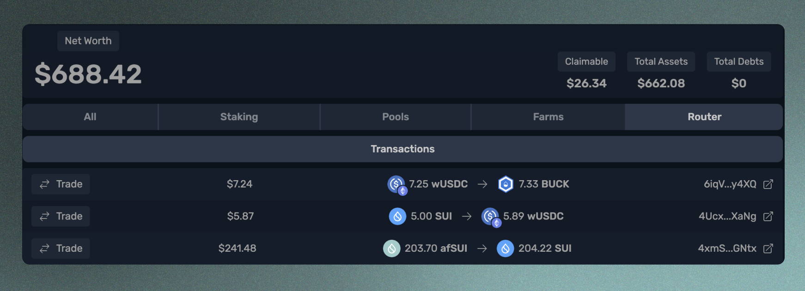

# 查看您的投资组合

导航到“投资组合”选项卡，您可以在一个地方查看钱包中的所有硬币，并部署在Aftermath上的任何产品。 您还可以查看所有活动，例如执行交换、质押以及存入或提取来自池子或农场的操作。

<figure><figcaption>
投资组合页面，您可以按每种产品进行排序，以查看您的资产和活动
</figcaption></figure>

在投资组合页面的顶部，您将看到所有资产的详细情况。从左到右开始，首先是“净值”。这是您所有硬币的总价值，包括钱包中的硬币、存入流动性池和农场中的硬币、抵押SUI和afSUI以及未领取奖励。接下来，您可以看到您可要求提取的余额，“可索赔”余额表示您从一个农场赚取但尚未提取的任何奖励。 “总资产”代表净值减去可索赔余额。“总债务”代表您已借入硬币的价值。

就在下方，您将看到一系列选项卡，允许按不同产品进行排序以查看每个产品的资产和活动情况。我们将在这里对它们进行全面审查。

## **所有**

选择“全部”选项卡会显示三个子选项卡：硬币、NFT和交易。 选择硬币将向您展示钱包中的每个硬币，包括LP代币。 请注意，存入农场的LP代币不会显示在这里，因为它们不在您的钱包中，但可以在“农场”选项卡下找到。

<figure><figcaption>
所有硬币组合显示
</figcaption></figure>

NFT子选项卡允许您查看所有的NFT。单击它们将打开一个新选项卡，允许您在所选择的Sui资源管理器中检查NFT。如果您想要转移一个NFT，可以通过钱包下拉菜单进行操作。请参阅与您的钱包互动以获取有关如何转移NFT的说明。

<figure><figcaption>
NFT展示
</figcaption></figure>

选择“交易”子选项卡将显示您在Aftermath上的所有活动，无论是交易、存款、质押、索取奖励还是其他任何事情。您可以轻松跟踪所有活动，并通过单击与之关联的链接来检查每笔交易在区块浏览器上的情况。

<figure><figcaption>
投资组合所有交易显示
</figcaption></figure>

## **质押**

选择“质押”选项卡将显示两个子选项卡，“质押仓位”和“交易”。每次您为afSUI进行质押都会产生一个新的质押仓位。所有的afSUI都是可互换的，您可以一次性取回所有的afSUI，但这样可以让您跟踪每次进行了质押。

<figure><figcaption>
投资组合质押头寸显示
</figcaption></figure>

在这里，您可以看到您抵押给了哪个验证器，抵押了多少SUI，并且已经被抵押了多少Epochs。点击右侧的链接将在区块浏览器中打开交易。"交易"子选项卡显示类似信息，但还会显示取消质押操作。

## **池子**

池选项卡包含两个子选项卡："LP Coins"和"Transactions"。选择LP Coins将显示当前在您钱包中的所有流动性提供者代币。当您向AMM存入流动性时，您会收到LP代币。您还会找到一个按钮，该按钮将直接带您进入每个LP代币所属的池子。请注意，如果随后将LP代币质押到农场中，则不会在此处显示它们。相反，在农场选项卡下找到它们。这是因为如果将LP代币存入农场，则它将被锁定在农场中，并不再是钱包中的一种代币。

<figure><figcaption>
投资组合池LP代币显示
</figcaption></figure>

Transactions子选项卡将显示您执行的所有存款和提款池中的交易：

<figure><figcaption>
投资组合池交易显示
</figcaption></figure>

## **农场**

“农场”选项卡包含子选项卡“Farming Positions”和“Transactions”。 “种植头寸”显示您存入农场的所有LP代币，以及有关其锁定状态、已赚取奖励和当前年化收益率的一目了然信息。 还有一个按钮，可以直接进入相应的农场：

<figure><figcaption>
投资组合农场种植位置展示
</figcaption></figure>

交易子选项卡显示您为所有农场头寸执行的所有操作，包括质押、解除质押、锁定和收获奖励等操作：

<figure><figcaption>
投资组合农场交易显示
</figcaption></figure>

## **路由器**

“路由器”选项卡将显示您使用Aftermath的智能订单路由器执行的所有交换。它显示了交易的名义价值、发送和接收到的硬币类型和数量，以及查看在区块浏览器上的交易链接。

<figure><figcaption>
投资组合路由器显示
</figcaption></figure>
