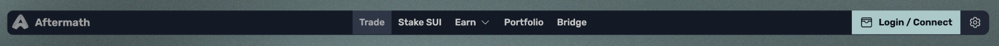

# Native Sui wallets

有许多本地Sui钱包可以添加到您喜爱的浏览器中。这些钱包安全且易于使用，因此选择哪个钱包仅仅是个人偏好问题。

要开始，请打开Aftermath dApp，并单击屏幕顶部导航栏右侧的登录/连接按钮。

<figure><figcaption>
导航栏右侧的登录/连接按钮
</figcaption></figure>

钱包连接界面将显示一个可以与Aftermath一起使用的钱包列表。点击任何标记为“未安装”的钱包，将会链接到官方网店，在那里您可以将扩展程序安装到您的浏览器中。

<figure><figcaption>
登录/连接界面
</figcaption></figure>

只需按照网络商店页面上的说明，完成将钱包安装到您的浏览器中。
