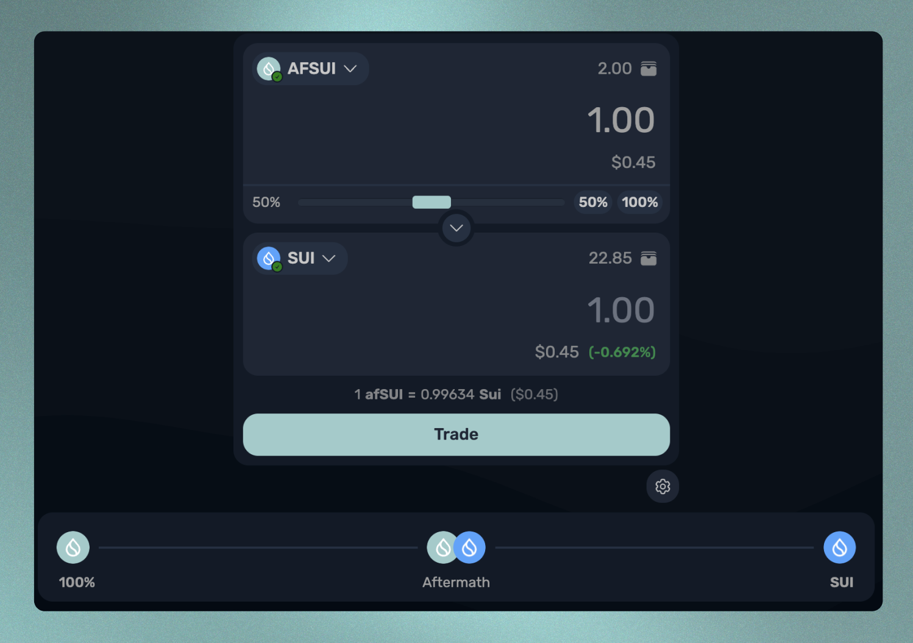

# 解除质押

将afSUI兑换为SUI很简单，但是可以通过多种方式实现这一目标，具体取决于用户的需求和偏好。首先，请导航到Unstake选项卡查看您的选择。

<figure><figcaption></figcaption></figure>

在这里，您将看到两个解除质押选项：立即解除质押和在X小时内解除质押，其中X是直到Sui网络当前纪元结束剩余的时间。

Sui上的质押和解除质押操作每次时代推进时发生，即每24小时一次。这意味着执行标准解除质押程序将需要用户等待直到时代推进以在其钱包中收到他们的SUI代币。对于一些用户来说，他们可能不想等待这么长时间。

为了提供更多灵活性，Aftermath 保留了一定数量的 SUI 代币，用户可以从中提取以执行即时解锁操作，并收取少量费用。费用取决于用户希望赎回的 afSUI 数量以及储备中剩余的 SUI 代币数量。每个纪元，储备都会得到补充。

每种解除质押类型的费用都会显示出来，让用户决定是等待时代推进还是立即收取他们的SUI代币。一旦您决定使用哪种解除质押方法，请输入您想赎回的afSUI数量并点击“解除质押”。

有第三种方法可以兑换 afSUI 为 SUI，即使用我们的智能订单路由器进行交换。事后和其他几个去中心化交易所维护 afSUI-SUI 流动性池，以便进行这些交易。根据流动性池和事后即时解锁储备的库存情况，可能更倾向于利用这种方法。转到我们的交易页面，并选择 afSUI 作为要交换的资产，选择 SUI 作为要接收的资产，以查看当前的汇率。

<figure><figcaption></figcaption></figure>

