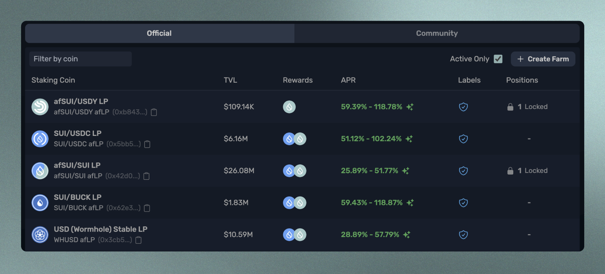

# 创建农场

通过无需许可的农场创建，任何人都可以通过在Aftermath上设置自己的农场来通过代币发行奖励他们的社区。只需按照以下简单步骤开始：

首先，您需要在Aftermath上拥有一个流动性池，您想要为其创建一个农场。如果您尚未设置池，请按照《[创建池](../../chi-zi/jiao-cheng/chuang-jian-yi-ge-chi.md)》中的说明操作。如果您想为代币而不是池创建一个农场，则可以跳过此步骤。

池设置完成后，请导航至农场页面。在屏幕右上方，所有活动农场列表上方，您会看到一个 <mark style="color:blue;">+ Create Farm</mark>按钮。单击此处开始。

<figure><figcaption>
+Create Farm在页面右上方
</figcaption></figure>

第一步是为池指定抵押币种。这是用户将抵押到农场中的币种，通常是您创建的池子的LP代币。您可以从屏幕顶部菜单栏访问的钱包中复制该币种，只需向下滚动至未识别的硬币，并单击 LP 代币地址下方您想要为其创建农场的地址旁边的剪贴板图标，然后将该地址粘贴到“抵押币种”字段中。

一旦您粘贴了代币地址，Stake Coin 将显示在屏幕底部，您可以确认它是否是正确的。

<figure><figcaption>
创建农场菜单。将Stake Coin Type粘贴到左上角的字段中。
</figcaption></figure>

在创建您的农场之前，有一些参数需要指定值：

**最小质押金额：**用户可以质押到您的农场中的最小硬币数量。我们建议将此设置为1，但如果更适合您的LP代币，则可以选择不同的值。

**最大锁定倍数（1-18）：**您可以选择为将其代币锁定在农场中特定时间段内提供更高奖励发放速率的LPs。这是为了奖励那些承诺长期向您池提供流动性的用户，但是可选项。如果您不想要锁定农业头寸选项，请将此值设置为1。

如果您想要以更高奖励率进行锁仓，请确定所需乘数大小。输入的值是用户将获得的乘数，如果他们按照允许时间内最长可能时限进行锁仓。

例如，如果您将最大锁定倍增器设置为2，并将最大锁定持续时间设置为1个月，则锁定1个月的用户将以两倍于完全不锁定的用户的速度获得奖励。 锁定2周的用户将以1.5倍于完全不锁定的用户的速度获得奖励。 发行速率从无锁到最大锁按线性比例缩放。

**最小锁定持续时间**：用户可以进行锁仓的最短时间。我们建议将其设置为0个月0天，因为这样可以使对用户来说是可选项。 如果您希望每位存入农场资金的用户都必须进行一段时间的锁仓，您可以在此处指定该最小持续时间。

**最大锁定持续时间：**用户可以进行长期锁仓的时限。 进行此段时限内的长期冻结会提供最大化加密乘数，并导致可能获得到枚举发行速率中所能达到之巨额奖励。 如果您不想要有任何形式上可选择是否要进行冻结操作，请将这些字段设为0。

一旦您根据自己喜好指明了每个参数后，就可以单击“创建农场”来部署您自己设计出来地农场。

<figure><figcaption>
农场管理设置 - 初始化奖励
</figcaption></figure>

现在您的农场已经创建好了，您可以从Aftermath的农场页面访问它。在农场页面上选择社区选项卡，您会看到您新创建的农场列出来。点击进入后，您会看到页面顶部有两个选项卡，用户视图和管理员设置。选择管理员设置来管理您的农场。请注意，要访问管理设置，必须使用创建该农场的Sui地址连接到Aftermath，我们稍后将介绍也可以共享管理权限。

**初始存款奖励：**为了让您的农场开始发放奖励，您必须首先初始化奖励。在这里，您将指定希望农场作为奖励发放的代币，例如SUI或您项目自己的代币。使用“选择代币”下拉菜单，选择您想要发放的代币。请注意，您的农场可以通过逐个初始化它们来发放多个代币。

**发行频率（毫秒）：**一旦指定了奖励代币，您必须为农场指定发行频率。这是基本级别的发行速率，在其中没有添加乘数，在此速率下，农场将向那些抵押到农场中的用户分配代币。在此输入值是每毫秒农场将会产生多少数量的奖励代币，并根据他们抵押金额和锁仓乘数大小按比例分享给所有用户。

要确定应该设置何种发行频率，请考虑预计有多少流动性会被抵押到农场中以及所需年化收益率是多少。请注意可以增加发行速度但不能减少它。如果不确定，当年化收益低于期望时总是可以增加速度。如果对这一特定步骤有疑问，请在Discord上联系我们团队成员可提供协助。

**开始排放（毫秒）：**这为您提供了延迟排放开始一段时间的选项。如果您想先设置好农场再在社交媒体上宣布，以及防止人们在您希望他们能够获得奖励之前发现它。

一旦满意您的参数，请点击初始化奖励。接下来，点击存入奖励标签页将您的奖励代币添加到保险库中。

<figure><figcaption>
农场管理设置 - 存款奖励
</figcaption></figure>

您现在可以将奖励代币或硬币存入您的农场。您会看到已初始化的每个代币都列出来；如果您想添加另一个代币，只需按照之前的步骤初始化另一个奖励代币。

要确定要存入农场的奖励代币数量，请考虑您的发行速率以及在需要再次存入更多奖励之前要运行农场的时间长度。请注意，如果您有锁定倍增器，则总发行速率将介于基本水平和基本水平乘以最大锁定倍增器之间，具体取决于有多少用户进行了锁定以及持续时间。

一旦确定了要存入的金额，请点击“存款奖励”将硬币添加到保险库中。

<figure><figcaption>
农场管理设置 - 增加排放
</figcaption></figure>

随着您的农场中锁定的总价值增加，每个用户收到的年化百分比将减少。为了继续激励您池塘的增长，您可能希望提高发行速率。要这样做，只需导航到“增加发行”选项卡，并输入您想为农场设置的新发行速率。请注意，无法降低发行量。

<figure><figcaption>
农场管理设置 - 授予管理权限
</figcaption></figure>

最后，可以与另一个Sui地址共享管理员权限以允许其他人访问您的保险库的管理设置。这将向另一个地址授予一次性管理员权限，使他们能够执行具有单次使用功能对象的权限函数（例如添加奖励或更改发行量）。这对于授予其他团队成员访问权限或者在合作伙伴关系中，另一个团队可能希望用自己的代币赞助您的农场是很有用的。只需粘贴要与之共享管理员访问权限到您农场的Sui地址，并点击“授权管理员权限”以允许访问。

就是这样！我们很乐意协助完成任何步骤，所以如果您有任何问题，请随时通过[Discord](https://discord.gg/REkhvMFqry)联系我们。
