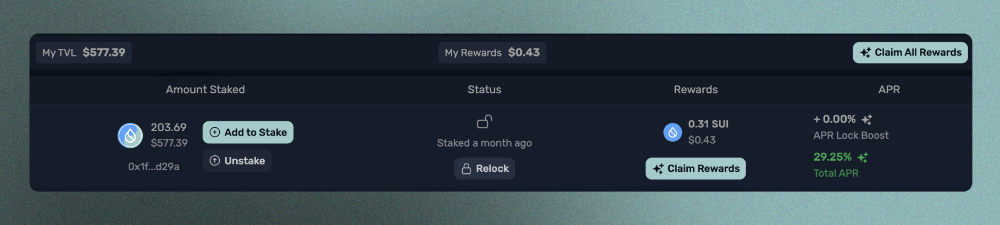

# 将资产抵押到农场

将您的LP代币存入农场以获得激励是简单的。当您存入一个具有相应Afterburner Vault的池子时，您会在页面顶部看到一个横幅，该横幅会直接将您带到那个农场。

<figure><figcaption></figcaption></figure>

或者，您可以导航到农场选项卡，查看通过Afterburner Vault激励的完整池列表。

<figure><figcaption></figcaption></figure>

一旦您导航到一个农场，您将能够检查有关该农场的指标，包括 TVL、APR、最大锁定期限以及在区块浏览器上的农场链接。

锁定期限为用户提供了通过将他们的流动性承诺一段特定时间来赚取更高APR的能力。这并非强制性要求，但如果用户对特定锁仓期限感到满意，则可以获得更多奖励的机会。

在质押框内，在用户可以指定要质押多少LP代币的地方下面是一个“锁仓期”滑块。用户可以移动此滑块以查看各种不同锁仓期间他们的APR 锁增益和总 APR，并选择他们最舒适的持续时间。

<figure><figcaption>
无锁提升
</figcaption></figure>

 

<figure><figcaption>
4天锁定提升
</figcaption></figure>

最大锁定持续时间对应奖励发行计划和补充，每两周一次在星期一进行。这是为了防止锁定时间超过当前奖励发行时代剩余的时间。如果您无法锁定，您将能够在下一个时代开始并新的奖励存入Afterburner保险库时进行锁定。

选择要抵押的LP令牌数量和锁定持续时间后，请单击“质押”按钮进入农场。然后，您将看到您的质押位置出现在页面底部。

<figure><figcaption></figcaption></figure>
